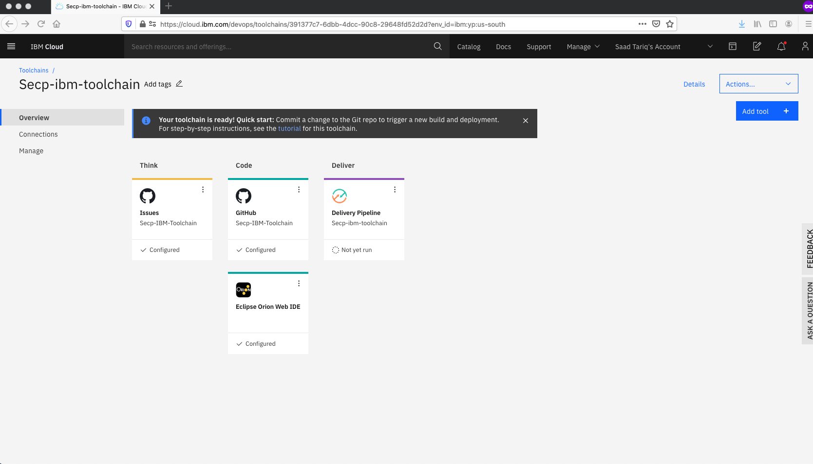

# SECP IBM Toolchain

Mordernize application using IBM toolchain

## Follow below steps:

### Step 1 : Sign-up for IBM Cloud Platform

[http://ibm.biz/](http://ibm.biz/)

### Step 2 : It's time to enable toolchain in our application

1. Select "Catalog"
2. Search for "Toolchain" .

3. Now you will see Continuous Delivery Toolchain page. Select "Develop a Cloud Foundary app"

4. In Gihub source provider section:
  1) Add Repository type as "Existing"
  2) Add Repository URl "https://github.com/Saaad-tariq/Secp-IBM-Toolchain.git"

[https://github.com/Saaad-tariq/Secp-IBM-Toolchain.git](https://github.com/Saaad-tariq/Secp-IBM-Toolchain.git)

5. In Tool Integration section , click "new" to generate API

6. Once everything is done press "Create" button

7. Now your toolchain is created and select "Delivery Pipeline"

8. In "Delivery Pipeline" your build stage will start
9. Wait until the your "Build stage" becomes green
10. After that your "Delpoy stage" will run automatically 

11. Once both the stages run successfully you will able to see it in green.

### Step 3 : Finally your application is up and running

1. Get back to your main page by selectung your app name on top

2. Click visit URL and see your app running

